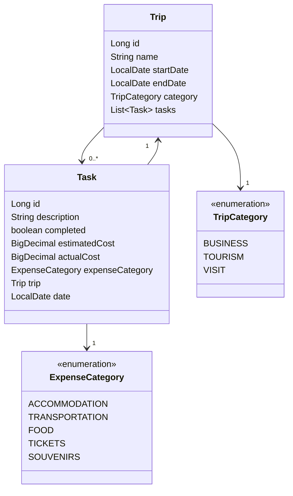

## Diagrama de Classes

```mermaid
classDiagram
    class Trip {
        Long id
        String name
        LocalDate startDate
        LocalDate endDate
        TripCategory category
        List~Task~ tasks
    }

    class Task {
        Long id
        String description
        boolean completed
        BigDecimal estimatedCost
        BigDecimal actualCost
        ExpenseCategory expenseCategory
        Trip trip
        LocalDate date
    }

    class TripCategory {
        <<enumeration>>
        BUSINESS
        TOURISM
        VISIT
    }

    class ExpenseCategory {
        <<enumeration>>
        ACCOMMODATION
        TRANSPORTATION
        FOOD
        TICKETS
        SOUVENIRS
    }

    Trip --> "1" TripCategory
    Trip --> "0..*" Task
    Task --> "1" Trip
    Task --> "1" ExpenseCategory
```