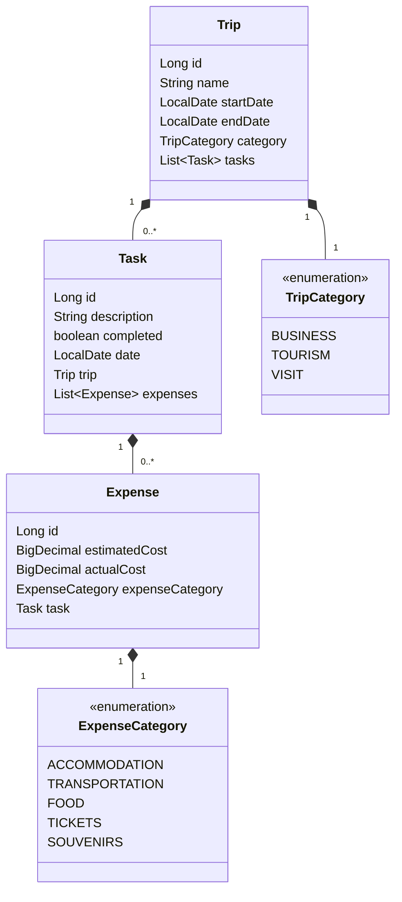

## Diagrama de Classes

```mermaid
classDiagram
    class Trip {
        Long id
        String name
        LocalDate startDate
        LocalDate endDate
        TripCategory category
        List~Task~ tasks
    }

    class Task {
        Long id
        String description
        boolean completed
        LocalDate date
        Trip trip
        List~Expense~ expenses
    }

    class Expense {
        Long id
        BigDecimal estimatedCost
        BigDecimal actualCost
        ExpenseCategory expenseCategory
        Task task
    }

class TripCategory {
    <<enumeration>>
BUSINESS
TOURISM
VISIT
}

class ExpenseCategory {
    <<enumeration>>
ACCOMMODATION
TRANSPORTATION
FOOD
TICKETS
SOUVENIRS
    }

Trip "1"*-- "1" TripCategory
Trip "1"*-- "0..*" Task
Task "1"*-- "0..*" Expense
Expense "1"*-- "1" ExpenseCategory
```