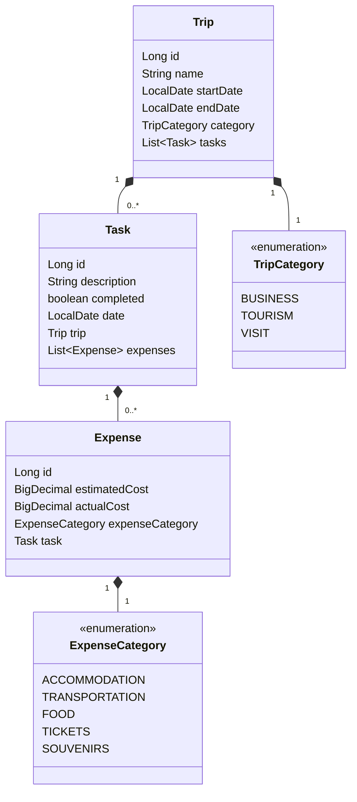

# Trip-Planner

## Objetivo

Criar uma API em Java usando o framework Spring Boot para desafio final de projeto para Bootcamp Desenvolvimento em Java com IA da DIO.

## Descrição

Esta é uma API de planejamento de viagem, atividades durante a viagem e controle de gastos.

## Diagrama de Classes

## Estrutura do Projeto
```
├───src
│   ├───main
│   │   ├───java
│   │   │   └───br
│   │   │       └───dev
│   │   │           └───drufontael
│   │   │               └───Trip_Planer
│   │   │                   ├───configuration
│   │   │                   ├───controller
│   │   │                   ├───dto
│   │   │                   ├───exception
│   │   │                   ├───model
│   │   │                   │   └───enuns
│   │   │                   ├───repository
│   │   │                   ├───service
│   │   │                   └───utils
```


## Tecnologias Utilizadas
- **Java**
- **Spring Boot**
- **ChatGPT**
- **Mermaid**
- **Springdoc Swagger**
- **Railway**

## Endpoints

### Trip Endpoints
- **Criar Trip:** `POST /trips`
- **Visualizar todas as Trips:** `GET /trips`
- **Visualizar Trip por ID:** `GET /trips/{id}`
- **Atualizar Trip por ID:** `PUT /trips/{id}`
- **Deletar Trip por ID:** `DELETE /trips/{id}`

### Task Endpoints
- **Criar Task:** `POST /trips/{tripId}/tasks`
- **Visualizar todas as Tasks por Trip:** `GET /trips/{tripId}/tasks`
- **Visualizar Task por ID:** `GET /trips/{tripId}/tasks/{taskId}`
- **Atualizar Task por ID:** `PUT /trips/{tripId}/tasks/{taskId}`
- **Deletar Task por ID:** `DELETE /trips/{tripId}/tasks/{taskId}`

### Expense Endpoints
- **Criar Expense:** `POST /trips/{tripId}/tasks/{taskId}/expenses`
- **Visualizar todas as Expenses por Task:** `GET /trips/{tripId}/tasks/{taskId}/expenses`
- **Visualizar Expense por ID:** `GET /trips/{tripId}/tasks/{taskId}/expenses/{expenseId}`
- **Atualizar Expense por ID:** `PUT /trips/{tripId}/tasks/{taskId}/expenses/{expenseId}`
- **Deletar Expense por ID:** `DELETE /trips/{tripId}/tasks/{taskId}/expenses/{expenseId}`

## Link do Deploy
[Trip Planner - Railway](https://trip-planner-production-b484.up.railway.app/swagger-ui.html)
